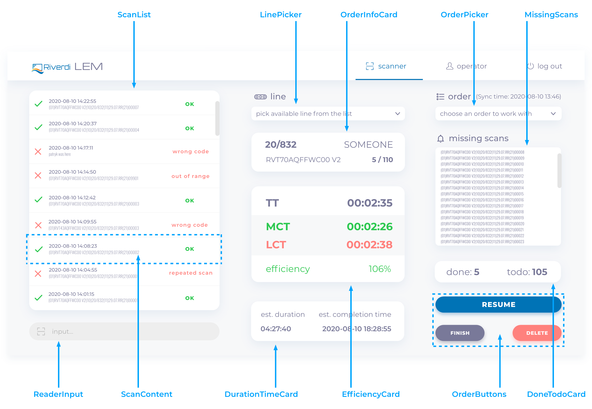

# GUI in ReactJS for LEM (Line Efficiency Monitoring) System

[**LEM System**](https://riverdi-lem.netlify.app/) is an internal tool for measuring and monitoring manufacturing/production lines **[app overview](https://github.com/thembones79/cs50x/tree/master/project#readme)**.

The project was created as the [final project](https://cs50.harvard.edu/x/2020/project/) to graduate [Harvard&#39;s CS50](https://cs50.harvard.edu/x/2020/) for benefit of my colleagues at Manufacturing Department of [Unisystem](https://www.unisystem-displays.com/en/) and [Riverdi](https://riverdi.com/) (Industrial display and touch screen manufacturer).

The application has to solve some issues that my folks have to tackle on daily basis.

## The main features of **[LEM System](https://github.com/thembones79/cs50x/tree/master/project#readme)**:

**The software has to:**

1. Utilize bar-code scanners (in fact, it is not a bar code but [Data Matrix](https://en.wikipedia.org/wiki/Data_Matrix) – it&#39;s 2D code, somewhat similar to QR Code) that the company bought for scanning newly developed stickers that are placed on ready made products (as input data)
2. Read MS Excel file with production schedule and part number details and retrieve data about `tact times`, `part numbers` and `orders` to work with.
3. Give an instant feedback about `MCT` (Mean Cycle Time), `LCT` (Last Cycle Time), `Efficiency`, estimated `order duration` and estimated `time of order completion`. (also with colors - GREEN and RED so people can instantly see if they are winning or losing)
4. Give an information about `order`, `customer`, manufactured piece (part number), ordered `quantity`
5. Give an information about `missing pieces`
6. Give an information of mixed up pieces (for example the same part number but form another order from same or another client
7. Give feedback about counting one piece more than once
8. Give information about how many pieces (of current order) was done on current line and on all the lines and how many pieces are to do
9. Give ability to have `breaks` during completion the given order
10. Give ability to `work on more than one line`
11. Give ability to `start an order on one line and finish it on another`
12. Give ability to work on `more than one order simultaneously`
13. Give ability to work on `the same (big) order on more than one line at the same time`
14. Handle users (production workers, service, foremen and managers) accounts (with `authorization` and `authentication`)
15. When user reserves a line, the line has to be unavailable to another user until it is released

**Future:**

Manager dashboard with:

1. Statistics: orders, users, lines, errors, times, partnumbers
1. User account management
1. Line management
1. Order and work scheduling (← that one, can be implemented only when the application will be independent form this huge excel spreadsheet that is currently a bread and butter of all department and everything is based on it)

## Frontend tooling:

- Project was initiated by [Create React App](https://github.com/facebook/create-react-app) tool.
- Using [Redux](https://redux.js.org/) for state management.
- Using [Redux Form](https://redux-form.com/) for form data handling.
- Side effects and asynchronous actions dispatches are handled in [Redux Thunk](https://github.com/reduxjs/redux-thunk) middleware.
- Using [React Router](https://reactrouter.com/) for routing.
- Using [SASS](https://sass-lang.com/) preprocessor and [BEM](http://getbem.com/) naming convention for CSS development
- [Wireframes](https://xd.adobe.com/view/63aa12c9-36fe-4d67-a34a-670e314ef771-36f9/grid) and [mockups](https://xd.adobe.com/view/e7eef714-c7ad-4872-819a-0de046fcd278-b2bd/grid) were created in Adobe XD

The app is meant to work with some kind of backend. In this particular system, there is a REST API in NodeJS ([app](https://riverdi-lem.herokuapp.com/), [code](https://github.com/thembones79/lem-server#readme)).

LEM System is meant to be an internal tool, so there is no &quot;sign up&quot; feature. Users can not add themselves to the system, they can be added only by admin/manager.

### Install:

```
npm install
```

### Run:

```
npm start
```

## Usage:

### Scanner Page

After successful log in a standard user (&quot;operator&quot;) would see Scanner Page (the main feature of the application). Here the user can:

- Pick a line to work on
- Pick an order to process
- Start order processing
- Input a scan data from barcode reader into the system
- Pause the order on chosen line (and, for example, work with another order)
- Resume paused order
- Finish the order
- Delete the order

<p align="center">
  
</p>

---

At this very moment the app has 35 components, the picture above shows 11 ones that standard user (&quot;operator&quot;) will see 99% of the time:

**ScanList** – shows a list (array) of `ScanContent` components (fetched from the API). The displayed list applies only to the selected order on the selected line.

**ScanContent** – shows formatted text content of particular scan with a timestamp (and result of scan validation with a message and appropriate icon).

**ReaderInput** – (disabled when chosen order is paused on chosen line or the order hasn&#39;t started yet) an input field that reads data from the scanner (text string with newline character at the end) and feeds it into the API

**LinePicker** – (disabled when ReaderInput is enabled) select field that fetches and shows lines with &quot;free&quot; status, and already occupied by current user.

**OrderPicker** – (disabled when `ReaderInput` is enabled or there is no picked line) select field that fetches and shows orders to work with (every option shows: `orderNumber`, `partNumber`, `customer`, `quantity`).

**OrderButtons** – there are 5 buttons for handling orders on the `scannerPage`:

- **`START`** – visible only if chosen order hasn&#39;t started yet, enables `ReaderInput` component, disables `LinePicker` and `OrderPicker`, creates (disabled) `FINISH` and `DELETE` buttons.
- **`PAUSE`** – visible only when order is in progress, adds a new break to selected order (request to the backend), disables `ReaderInput` component, enables `LinePicker`, `OrderPicker` components and `FINISH`, `DELETE` buttons.
- **`RESUME`** – visible only when order is paused, finishes started break (request to the backend), enables `ReaderInput` component, disables `LinePicker`, `OrderPicker` components and `FINISH`, `DELETE` buttons.
- **`FINISH`** – (enabled only when order is paused), changes the status of chosen order to &quot;closed&quot; (via confirmation modal), disables `ReaderInput` component, enables `LinePicker`, `OrderPicker` components, removes all buttons besides `DELETE`.
- **`DELETE`** – (enabled when order is paused or closed/finished) removes chosen order from system (via confirmation modal)

**MissingScans** – displays a list of scans needed to complete the order

**DoneTodoCard** – displays numbers item that are done on selected line and number of items to do (all lines in total)

**OrderInfoCard** – displays general information about selected order: order number, customer, part number, quantity, items done (on all lines)

**EfficiencyCard** – displays:

- **`TT` (Tact Time)** – a time given to produce one item,
- **`MCT` (Mean Cycle Time)** – mean time between scans (breaks excluded) (red when higher than `Tact Time`, green when equal or lower)
- **`LCT` (Last Cycle Time)** – time between last and penultimate scan (break time excluded) (red when higher than `Tact Time`, green when equal or lower)
- **`Efficiency` (in %)** – the ratio of `Tact Time `to `Mean Cycle Time` (red when below 100%, green when equal or above)

**DurationTimeCard** – shows estimated duration and estimated completion time of the whole order. When order is done the component shows real total duration and actual completion time.

### Closing/finishing orders

An order can be closed in two ways:

1. User can click `FINISH` button
2. User scanned all pieces of order (and order closes itself automatically)

## Dashboard

Besides `Scanner Page`, there is also `Dashboard Page` available. That page can be accessed only by user with a &quot;manager&quot; privileges. Currently it is almost empty, but in the near future it would be enhanced with: order and work scheduling (requires independence from the source excel spreadsheet), user management, line management, order management, very comprehensive statistics about errors, efficiency, tact times, cycle times, part numbers, lines with comparisons, orders, users (maybe with charts), and &quot;1 page all lines live view&quot;.

## [ > Detailed Project Overview < ](https://github.com/thembones79/cs50x/tree/master/project#readme)
